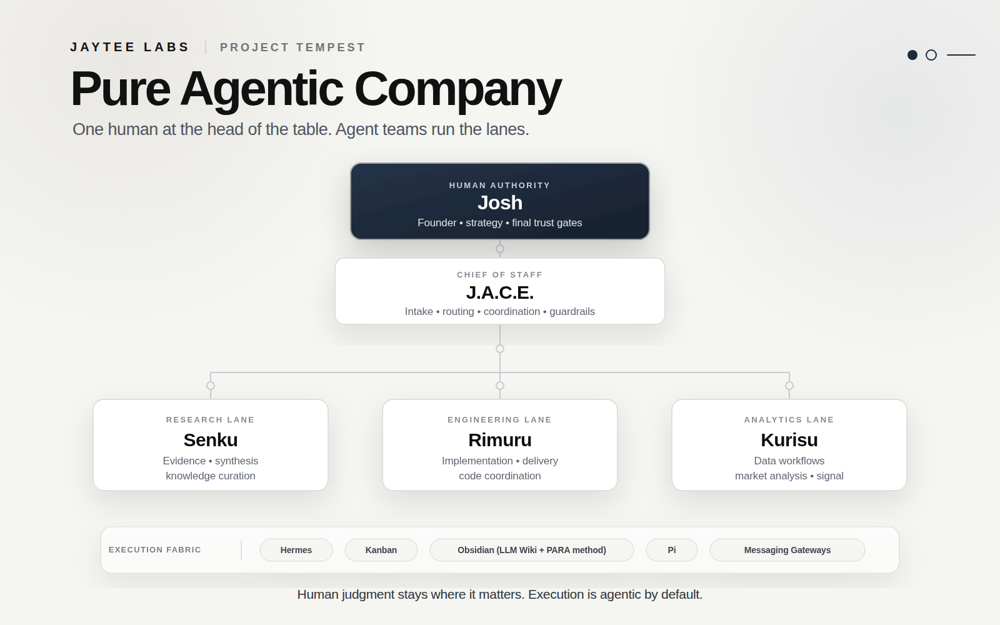

# JayTee Labs

**JayTee Labs is a pure agentic company: one human at the head of the table, agent teams doing the work.**

We build practical AI systems around a simple operating model: humans keep strategy, taste, trust, and final judgment; agents handle the execution loops — research, engineering, analysis, operations, and the glue between them.

## How we operate

JayTee Labs runs through **Project Tempest**, an agentic operating system designed to turn work into coordinated flow without turning autonomy into chaos.

- **One human authority** sets direction, makes high-impact calls, and owns trust boundaries.
- **J.A.C.E.** acts as chief of staff: intake, routing, coordination, escalation, and guardrails.
- **Specialized agents** own functional lanes across research, engineering, and analytics.
- **Shared systems of record** keep the company inspectable: tasks, knowledge, decisions, and handoffs stay visible.

This is not a conventional software shop with AI sprinkled on top. The company is agentic by design.

## What we build

We build systems for people who want AI to do real work without losing control of the work itself:

- Agentic software and multi-agent workflows
- AI-assisted engineering systems
- Knowledge, memory, and research infrastructure
- Human-in-the-loop automation
- Internal tools that turn messy ideas into shippable products

## Principles

- **Agentic by default** — execution should move through capable agents, not manual busywork.
- **Human-gated where it matters** — trust, identity, credentials, destructive changes, and strategic calls stay with the human.
- **Inspectable over magical** — every serious workflow needs traces, handoffs, and failure modes people can review.
- **Clear systems beat clever chaos** — orchestration matters more than swarm theater.
- **Shipping is the point** — demos are nice; durable systems are better.

## Status

Some repositories are polished. Some are experiments. Some are weird little prototypes with sharp edges and a suspicious amount of potential.

That’s the lab part.

---

**JayTee Labs**  
One human. Agent-led execution.
